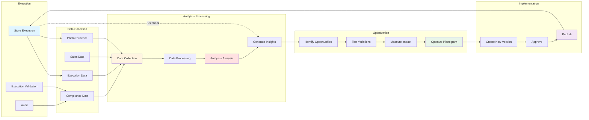

# Analytics Feedback Loop

## Overview

This diagram shows the continuous feedback loop from execution through analytics to optimization.

## Mermaid Diagram

## Feedback Loop Stages

### 1. Execution

**Activities:**
- Store execution
- Execution validation
- Auditing
- Data collection

**Data Generated:**
- Execution data
- Compliance data
- Photo evidence
- Audit results

### 2. Data Collection

**Activities:**
- Collect execution data
- Collect sales data
- Collect compliance data
- Aggregate data

**Data Sources:**
- Mobile app
- POS systems
- Audit systems
- External systems

### 3. Analytics Processing

**Activities:**
- Process data
- Analyze performance
- Generate insights
- Identify patterns

**Analytics Types:**
- Compliance analytics
- Sales analytics
- Space analytics
- Performance analytics

### 4. Optimization

**Activities:**
- Identify optimization opportunities
- Test variations
- Measure impact
- Optimize planogram

**Optimization Areas:**
- Placement optimization
- Space optimization
- Rule optimization
- Category optimization

### 5. Implementation

**Activities:**
- Create optimized version
- Approve changes
- Publish to stores
- Execute new version

**Implementation Process:**
- Create new planogram version
- Approval workflow
- Publication
- Execution

## Continuous Improvement

### Cycle

1. **Execute**: Execute planogram in stores
2. **Collect**: Collect execution and sales data
3. **Analyze**: Analyze performance
4. **Optimize**: Optimize based on insights
5. **Implement**: Implement optimized version
6. **Repeat**: Continuous cycle

### Benefits

- **Data-Driven**: Decisions based on data
- **Continuous Improvement**: Ongoing optimization
- **Performance Gains**: Measurable improvements
- **Learning**: Learn from execution data

## Key Metrics

### Execution Metrics

- Execution compliance
- Placement accuracy
- Execution time
- Quality score

### Sales Metrics

- Sales impact
- Category performance
- Product performance
- Space efficiency

### Compliance Metrics

- Rule compliance
- Brand compliance
- Category compliance
- Regulatory compliance

## Best Practices

1. **Continuous Monitoring**: Monitor performance continuously
2. **Data-Driven Decisions**: Base decisions on data
3. **Test and Learn**: Test changes, measure impact
4. **Iterative Improvement**: Continuous iteration
5. **Share Insights**: Share insights across teams
