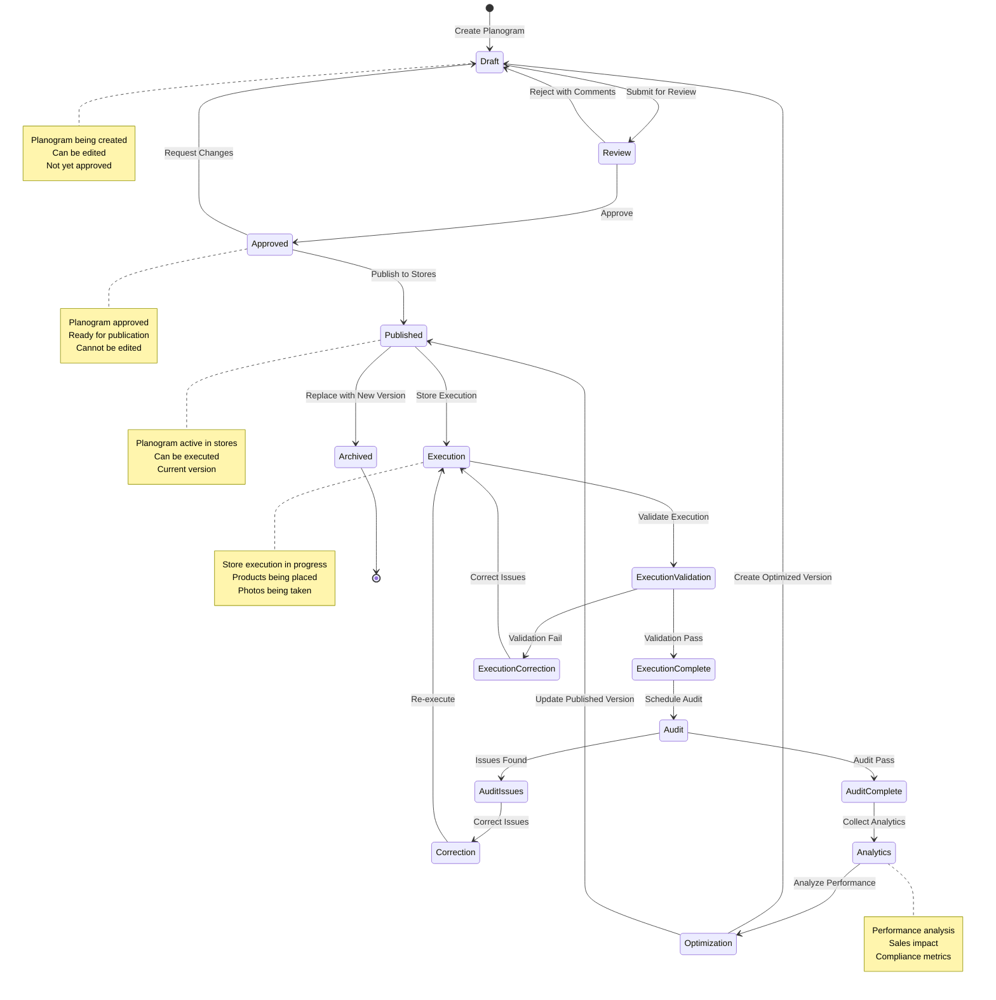

# Planogram Lifecycle

## Overview

This diagram shows the complete lifecycle of a planogram from creation through execution, auditing, and optimization.

## Mermaid Diagram

## Lifecycle Stages

### 1. Draft

**Characteristics:**
- Planogram being created or modified
- Can be edited freely
- Not yet approved
- Not published to stores

**Activities:**
- Create planogram
- Edit placements
- Apply rules
- Validate constraints

### 2. Review

**Characteristics:**
- Planogram submitted for review
- Under review by authorized person
- Can be approved or rejected

**Activities:**
- Review planogram
- Check compliance
- Validate rules
- Approve or reject

### 3. Approved

**Characteristics:**
- Planogram approved for publication
- Ready to publish
- Cannot be edited (must create new version)

**Activities:**
- Planogram approved
- Ready for publication
- Can publish to stores

### 4. Published

**Characteristics:**
- Planogram published to stores
- Available for execution
- Active version in stores

**Activities:**
- Publish to stores
- Notify store managers
- Make available for execution

### 5. Execution

**Characteristics:**
- Store execution in progress
- Products being placed
- Validation ongoing

**Activities:**
- Execute planogram in store
- Place products
- Capture photos
- Validate execution

### 6. Execution Validation

**Characteristics:**
- Execution being validated
- Photos reviewed
- Checklist verified

**Activities:**
- Review execution
- Validate against planogram
- Check compliance
- Approve or request correction

### 7. Audit

**Characteristics:**
- Audit scheduled and executed
- Compliance verified
- Issues identified

**Activities:**
- Conduct audit
- Review execution
- Check compliance
- Generate audit report

### 8. Analytics

**Characteristics:**
- Performance data collected
- Analytics processed
- Insights generated

**Activities:**
- Collect execution data
- Collect sales data
- Analyze performance
- Generate insights

### 9. Optimization

**Characteristics:**
- Planogram optimized based on data
- New version created
- Improvements implemented

**Activities:**
- Analyze performance
- Identify optimization opportunities
- Create optimized version
- Implement improvements

### 10. Archived

**Characteristics:**
- Planogram replaced by new version
- Historical record
- No longer active

**Activities:**
- Archive old version
- Maintain history
- Reference for future

## State Transitions

### Valid Transitions

- **Draft → Review**: Submit for approval
- **Review → Approved**: Approve planogram
- **Review → Draft**: Reject, return for changes
- **Approved → Published**: Publish to stores
- **Published → Execution**: Store execution
- **Execution → Execution Validation**: Validate execution
- **Execution Validation → Execution Complete**: Validation passes
- **Execution Validation → Execution Correction**: Validation fails
- **Execution Complete → Audit**: Schedule audit
- **Audit → Analytics**: Collect analytics
- **Analytics → Optimization**: Optimize planogram
- **Optimization → Draft**: Create new version
- **Published → Archived**: Replace with new version

## Key Decision Points

1. **Approval**: Approve or reject planogram
2. **Publication**: Publish to stores
3. **Execution Validation**: Validate execution
4. **Audit**: Audit compliance
5. **Optimization**: Optimize based on data

## Best Practices

1. **Clear Workflow**: Defined workflow and states
2. **Approval Process**: Systematic approval
3. **Validation**: Validate at each stage
4. **Audit Trail**: Track all state changes
5. **Optimization**: Continuous optimization
