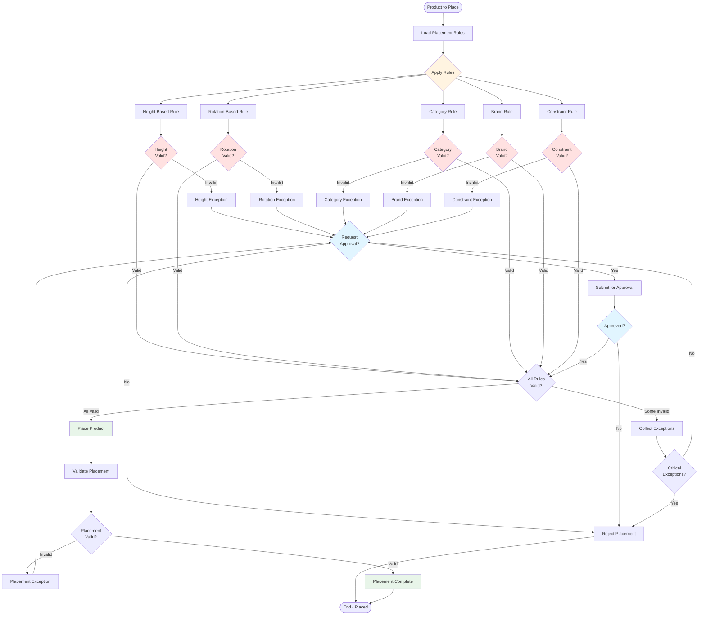

# Product Placement Flow

## Overview

This diagram shows the flow of product placement, including rule application, validation, and exception handling.

## Mermaid Diagram

## Flow Description

### 1. Rule Loading

**Process:**
- Load all applicable placement rules
- Rules include: height, rotation, category, brand, constraints
- Rules prioritized by importance

### 2. Rule Application

**Rules Applied:**
- **Height Rule**: Check height-based placement
- **Rotation Rule**: Check rotation-based placement
- **Category Rule**: Check category rules
- **Brand Rule**: Check brand rules
- **Constraint Rule**: Check physical constraints

### 3. Rule Validation

**Validation:**
- Each rule validated
- Rule compliance checked
- Violations identified
- Exceptions collected

### 4. Exception Handling

**Exception Types:**
- **Height Exception**: Height rule violation
- **Rotation Exception**: Rotation rule violation
- **Category Exception**: Category rule violation
- **Brand Exception**: Brand rule violation
- **Constraint Exception**: Constraint violation

**Exception Process:**
- Identify exception
- Classify severity
- Request approval if needed
- Handle exception

### 5. Approval Process

**Approval:**
- Exception submitted for approval
- Authorized person reviews
- Approve or reject
- If approved, proceed with placement

### 6. Product Placement

**Placement:**
- Product placed at position
- Placement validated
- If valid, placement complete
- If invalid, exception handling

### 7. Completion

**Completion:**
- Placement validated
- Product placed successfully
- Placement recorded
- Planogram updated

## Key Decision Points

1. **Rule Validation**: All rules must be valid
2. **Exception Approval**: Exceptions require approval
3. **Placement Validation**: Placement must be valid
4. **Critical Exceptions**: Critical exceptions reject placement

## Best Practices

1. **Comprehensive Rules**: All rules applied
2. **Systematic Validation**: Validate all rules
3. **Exception Management**: Systematic exception handling
4. **Approval Process**: Clear approval process
5. **Validation**: Validate placement before completion
