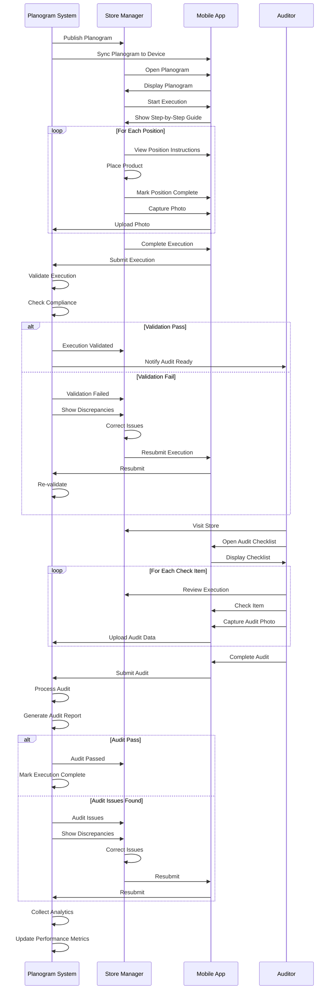

# Store Update and Validation Flow

## Overview

This diagram shows the flow of planogram execution in stores, including validation and discrepancy handling.

## Mermaid Diagram

## Flow Description

### Phase 1: Planogram Publication

1. **System Publishes**: Planogram published to stores
2. **Sync to Device**: Planogram synced to mobile app
3. **Store Notification**: Store manager notified

### Phase 2: Store Execution

1. **Open Planogram**: Store manager opens planogram in app
2. **Step-by-Step Guide**: App shows execution guide
3. **Place Products**: Products placed per planogram
4. **Capture Photos**: Photos taken as evidence
5. **Submit Execution**: Execution submitted

### Phase 3: Validation

1. **Automated Validation**: System validates execution
2. **Compliance Check**: Compliance checked
3. **Discrepancy Detection**: Discrepancies identified
4. **Correction**: Issues corrected if needed

### Phase 4: Audit

1. **Audit Scheduled**: Audit scheduled
2. **Store Visit**: Auditor visits store
3. **Checklist Review**: Checklist reviewed
4. **Photo Capture**: Audit photos taken
5. **Audit Submission**: Audit submitted

### Phase 5: Audit Processing

1. **Process Audit**: Audit processed
2. **Generate Report**: Audit report generated
3. **Issue Handling**: Issues handled
4. **Completion**: Execution marked complete

### Phase 6: Analytics

1. **Data Collection**: Execution and audit data collected
2. **Performance Metrics**: Performance metrics updated
3. **Analytics Processing**: Analytics processed

## Key Features

- **Mobile-First**: Execution via mobile app
- **Step-by-Step**: Clear execution guidance
- **Photo Evidence**: Photos as evidence
- **Automated Validation**: System validates execution
- **Audit Support**: Comprehensive audit support
- **Analytics**: Performance tracking
